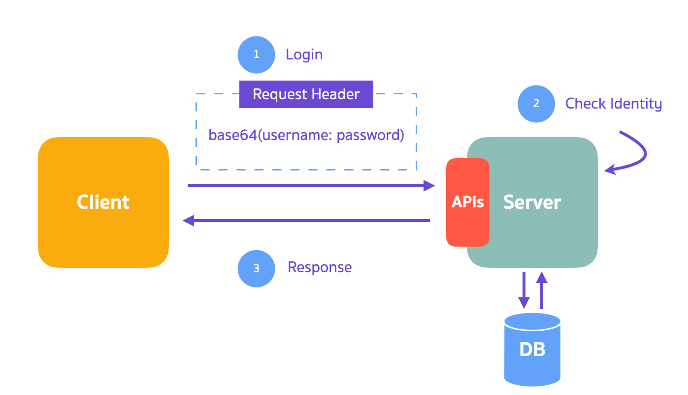
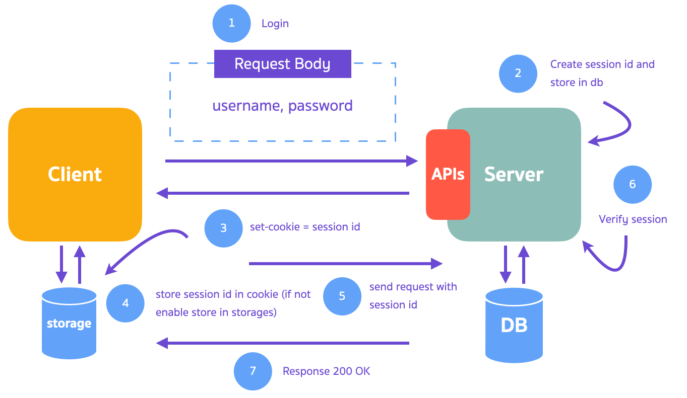
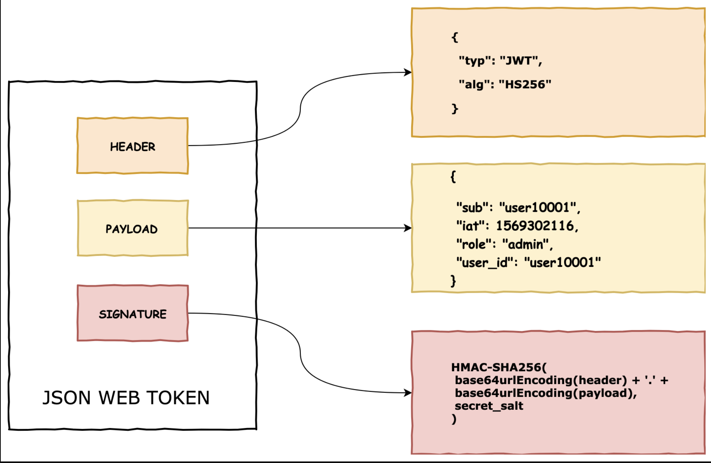
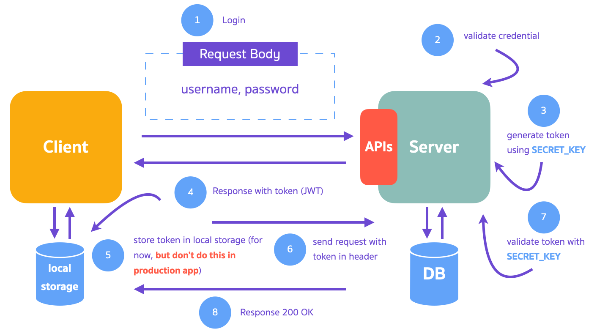

# Basic Authentication

Authentication ในเชิง Computing คือ **ขั้นตอนการยืนยันตัวตน**ของ Users หรือ Processes

Authentication มีหลายรูปแบบ

- Basic Authentication
- Session-Based Authentication
- Token-Based Authentication
- OAuth
- Etc.

 
 

## Basic Authentication

เป็น Authentication แบบบ้านที่สุด

1. เราจะ **encrypt username:password ด้วย base64** จากนั้น ทุก ๆ Request เราจะแนบ base64 string ไปใน Request Header ทุกคร้ัง

2. Server ทำการ verify username และ password

3. ถ้า username และ password ถูกต้อง จะ Return reponse กลับไป

**ข้อดี**

- เข้าใจง่ายตรงไปตรงมา

**ข้อเสีย**

- ไม่ค่อยปลอดภัย เราสามารถโดนดัก request แล้วแกะ username และ password ออกมากจาก base64 string (ต้อง Setup HTTPS)

 
 

## Session-Based Authentication

เป็นการทำ Authentication ด้วย Session

Session คือ ชิ้นส่วนของข้อมูลที่เก็บไว้บน Server

1. เรา login เข้าระบบด้วย username และ password

2. จากนั้น server จะทำการ verify username password และ สร้าง session id เก็บไว้ใน db

3. session id จะถูกส่งกลับไปให้ client ผ่าน cookie

- Cookie คือชิ้นส่วนของข้อมูล ที่เก็บไว้ในเครื่องคอมของเรา ที่สามารถบอกได้ว่าเราเป็นใคร และช่วยให้ experience ในการใช้งาน web application ของเราดีขึ้นด้วย

4. เมื่อ client ได้รับ cookie แล้ว client จะเก็บ cookie ไว้ใน storage ส่วนตัว (ถ้า cookie ถูก disabled จะเก็บไว้ใน local stoage หรือ session storage)

5. เมื่อเรา request ไปหา server เราจะแนบ session id ไปด้วยเสมอ ๆ

6. จากนั้น server จะทำการ validate session id ใน db

7. ถ้า session valid จะ return response กลับไป

**ข้อดี**

- Implement ง่ายกว่า

**ข้อเสีย**

- เนื่องจาก Server ต้องเก็บ Session ของ User ไว้ที่ฝั่ง Server ทำให้ Scale ยากกว่า Token-based Authentication

 
 

## Token-Based Authentication (JWT)

JWT เป็น String ยาว ๆ ที่ประกอบไปด้วย 3 ส่วน

- Header
- Payload
- Signature

**ข้อดี**

- Scale ได้ง่าย เนื่องจาก Token เก็บไว้ที่ Client
- ใช้งานง่าย ทำให้เราพัฒนา Web App ได้ไว

**ข้อเสีย**

- เนื่องจาก Server ต้องเก็บ Session ของ User ไว้ที่ฝั่ง Server ทำให้ Scale ยากกว่า Token-based Authentication
- Secret key มี 1 key ถ้าหลุดออกไป Attackers สามารถที่จะ Access user data ได้
- ยากต่อการทำความเข้าใจ เนื่องจาก JWT มี Algorithms ในการเข้ารหัสข้อมูล

 
 
