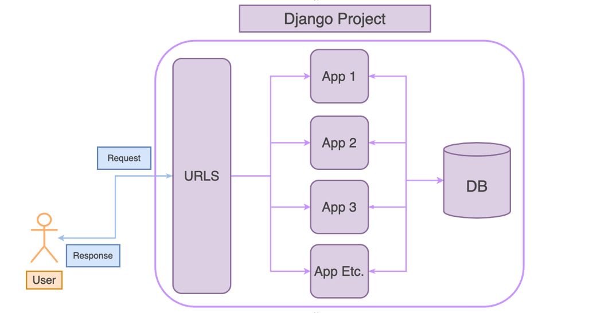
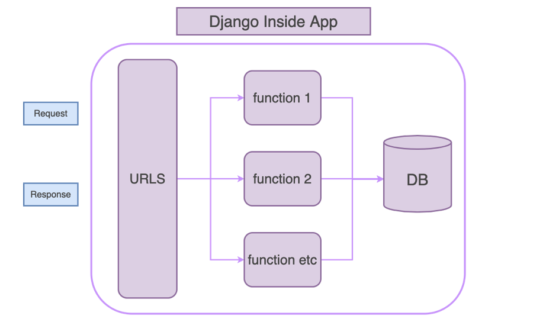

# Building First Simple API

เราจะมาลองสร้าง API ขึ้นมาสักตัวนึงง่าย ๆ แต่ก่อนอื่น เราจะไปทำความเข้าใจเรื่องของ Djando Project Architecture กันก่อน

<br><hr><br>

## Django Project Architecture



ภายใน django 1 project เราสามารถมีได้หลาย app ข้างใน

<br><hr><br>

## Creating First Django's App



เรามาลองสร้าง app ขึ้นมาสักตัว app ของเราตัวนี้ชื่อว่า “blogs”

ให้เรา cd เข้าไปที่ myproject folder จากนั้นพิมพ์คำสั่ง

`python manage.py startapp blogs`

จากนั้นเราจะเห็น folder blogs ขึ้นมา

## Our First API

เรามาลองดู API documents ที่เราเคยเขียนต่อจาก frontend กันสักนิดหน่อย

| Method | Path       | Description       | Request Body                                         |
| ------ | ---------- | ----------------- | ---------------------------------------------------- |
| GET    | /posts     | Get all posts     | None                                                 |
| GET    | /posts/:id | Get post by id    | None                                                 |
| POST   | /posts/    | Create post       | { "title": "post title", "content": "post content" } |
| PUT    | /posts/:id | Update post by id | { "title": "post title", "content": "post content" } |
| DELETE | /posts/:id | Delete post by id | None                                                 |

เราจะไปลองสร้าง API แรกของเรากัน ซึ่งคือ API GET /posts ให้เราไปเขียน views ขึ้นมาก่อน

**Views** เป็น functions ที่จะถูกเรียกใช้เวลา client ทำ request อะไรสักอย่างเข้ามาผ่าน endpoint path ที่กำหนดไว้

เราจะเขียน function ขึ้นมาชื่อ post_list มี parameter เป็น request dict จากนั้นจะ return response กลับไปด้วย HttpResponse ว่า "Hello, this is posts app"

```python
from django.shortcuts import render
from django.http import HttpResponse

def post_list(request):
    return HttpResponse("Hello, this is posts app")

```

จากนั้นเราไปกำหนด endpoint path ที่จะ link กับตัว function post_list ที่ view ของเราก่อนที่ `posts/urls.py` ถ้าไม่มีให้สร้างไฟล์ urls.py ขึ้นมา

```python
from django.urls import path

from . import views

urlpatterns = [
    path('', views.post_list, name=‘post _list’),
]

```

จากนั้นเราจะต้องสร้าง path สำหรับ app ใหญ่ของเราด้วยที่ `myproject/urls.py` ให้เราเพิ่ม path เข้าไปใน urlpatterns list

```python

from django.contrib import admin
from django.urls import include, path

urlpatterns = [
    path(‘posts/‘, include(‘posts.urls')),
    path('admin/', admin.site.urls),
]

```

จากนั้นให้เราลองเปิด postman แล้ว send request ด้วย HTTP Method GET ไปที่ http://127.0.0.1:8000/posts/ เราได้ response กลับมาว่า “Hello, this is posts app”

เรามาทำให้ api ของเรา return response ให้สมจริงขึ้นหน่อย เราจะ return ข้อมูลออกไปเป็น dict หน้าตาแบบนี้

```python
{
    "data": [
        {
            "id": 1,
            "title": "Post #1",
            "content": "This is post #1 content"
        }
    ]
}

```

```python
from django.shortcuts import render
from django.http import HttpResponse, JsonResponse

posts = {
    "data": [
        {
            "id": “1”,
            "title": "Post #1",
            "content": "This is post #1 content"
        }
    ]
}

def post_list(request):
    response = JsonResponse(posts)
    response.status_code = 200
    return response
```

เราจะสร้าง variable มาเก็บไว้ก่อนชื่อ posts

จากนั้นเราจะ import JsonResponse เข้ามาจาก django.http

เราจะสร้าง variable response จากนั้น เรียกใช้ JsonResponse function แล้วส่ง posts เข้าไปเป็น parameter data แล้วเราจะกำหนด response.status_code เป็น 200 แล้ว return response ออกไป

จากนั้นให้เราลองไป Send request ที่ Postman อีกทีเราจะได้หน้าตา response จาก API แบบที่เราต้องการ

_Checkout branch เพื่อดู code ส่วนข้างบนด้วย `git checkout create-first-simple-api`_
