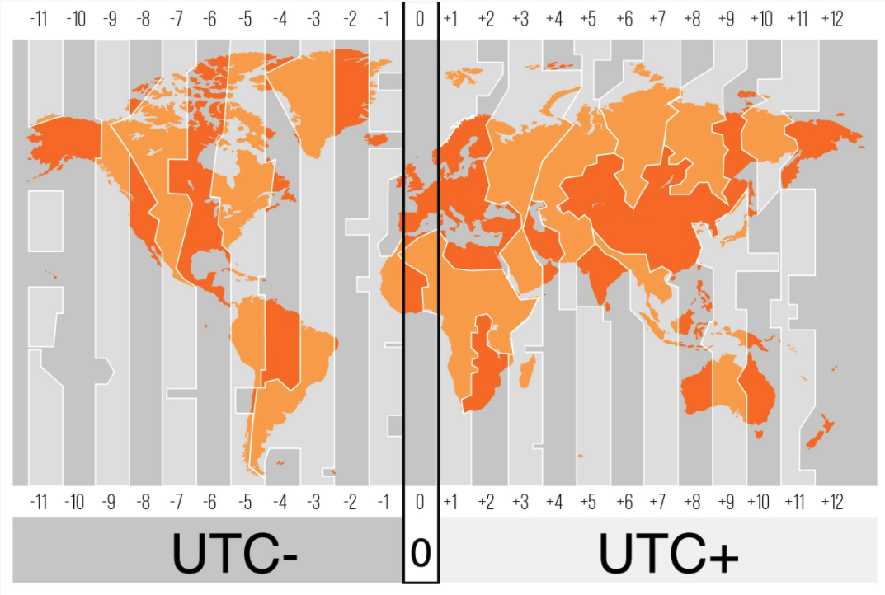

# Playing Around With Python

<br><hr><br>

## datetime

python มี built-in functions ที่เอาไว้จัดการเกี่ยวกับ datetime ให้เรา import มาจาก **datetime module**

<br><hr><br>

## now()

ถ้าเราอยากได้เวลาปัจจุบัน

```python
today = datetime.now()
print(today)
```

ถ้าเราอยากได้ datetime ที่เฉพาะเจาะจง

parameter ที่ควรรู้เบื้องต้นของ method ที่สร้าง datetime

`datetime(year, month, day, hour=0, minute=0, second=0, ...)`

```python
datetime = datetime(2021, 3, 19, 21, 40)
print(datetime)
```

<br><hr><br>

### datetime format

เราสามารถ format ให้อยู่ในรูปแบบที่เราสามารถอ่านได้แบบนี้

```python
today = datetime.now()
print(today.strftime("%m %B %Y %H:%M:%S"))
```

%m หมายถึง เดือน เช่น 01 - 12
%B หมายถึง ชื่อเดือนแบบเขียนเต็ม ๆ เช่น March
%B หมายถึง ปีแบบเขียนเต็ม ๆ เช่น 2021
%H หมายถึง จำนวนชั่วโมง เช่น 00-23
%M หมายถึง จำนวนนาที เช่น 00-59
%S หมายถึง จำนวนวินาที เช่น 00-59

สามารถดู Format การแสดงผลของวันเวลาเพิ่มเติมได้ [ที่นี่](https://www.w3schools.com/python/python_datetime.asp)

<br><hr><br>

## ISO 8601 date format

เป็นรูปแบบการแสดงผล dates และ times ในรูปแบบ international standard

รูปร่างหน้าตาจะเป็นประมาณแบบนี้ `2021-03-18T13:53:27Z`

มาลองดูตัวอย่าง code ที่เปลี่ยนให้ date time อยู่ในรูปแบบของ ISO 8601 กัน

```python
datetime.now().isoformat()
```

เราอาจจะสงสัยว่า **"Z"** คืออะไร ?

**Z (Zulu)** เป็นตัวที่บอกว่าเวลานี้เป็น **UTC Time**

**Coordinated Universal Time (UTC) เป็นระบบเวลาตัวนึง ที่อ้างอิงจากจุดศูนย์กลาง คือเมือง Greenwich, London**



ถ้าเราจะสร้างเวลาที่ UTC เราสามารถทำแบบนี้ได้

```python
datetime.utcnow().isoformat()
```

<br><hr><br>

## timedelta

ถ้าเราอยากได้เวลาที่กำหนดเองได้เป็นช่วงเราสามารถทำได้ด้วย timedelta

```python
timedelta(
  days=50,
  seconds=27,
  microseconds=10,
  milliseconds=29000,
  minutes=5,
  hours=8,
  weeks=2
)
```

ถ้าเราอยากเพิ่มเวลาจากปัจจุบันไป 1 วันเราสามารถทำแบบนี้ได้

```python
tmr = datetime.now() + timedelta(days=1)
```

<br><hr><br>
