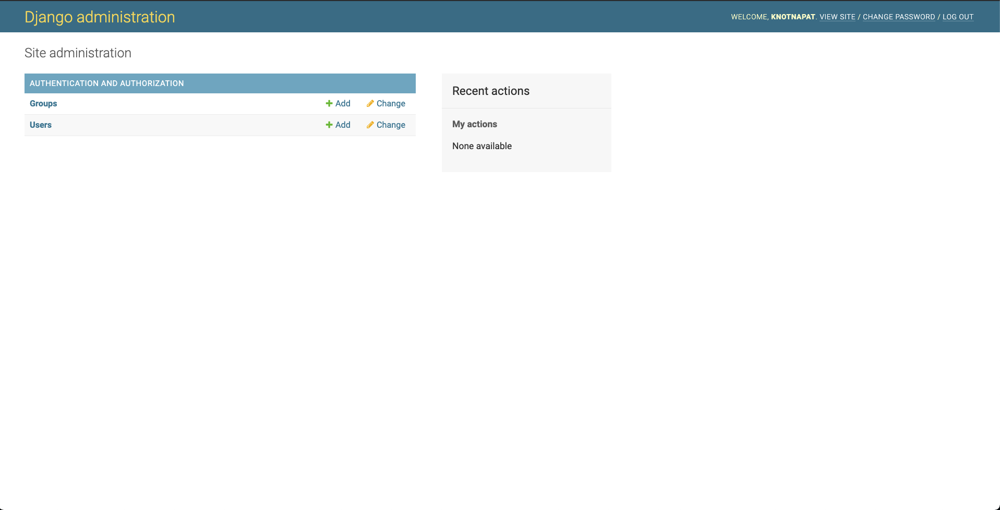

# Django JWT Authentication

## Django Authentication System

ก่อนที่เราจะสร้างระบบ Authentication เราจะสร้าง API สำหรับการลงทะเบียนก่อน ซึ่ง Django นั้นมีระบบ Authentication ที่ Built-in ไว้ให้อยู่แล้วเราจะมาลองเล่นกันสักนิดหน่อย

เราจะทำการสร้าง superuser ขึ้นมาในระบบด้วยคำสั่ง `python manage.py createsuperuser --username=knotnapat --email=knotnapat@gmail.com` จากนั้นให้เราใส่รหัสผ่าน

```
Password:
Password (again):
This password is too common.
This password is entirely numeric.
Bypass password validation and create user anyway? [y/N]: y
Superuser created successfully.
```

เมื่อเราสร้าง user ในระบบเสร็จเรียบร้อยให้เราเข้าไปที่ `http://localhost:8000/admin` เราจะเห็นหน้าเว็บ Admin ของ Django ที่สร้างไว้ให้เราเรียบร้อยแล้วให้เราใส่ username password ที่เราสร้างเมื่อกี้ได้เลย

Django จะพาเราเข้ามาข้างในระบบหลังบ้านของ Admin หน้าตาจะเป็นแบบนี้



ให้เราลองกดเข้าไปที่ Users เราจะเห็นข้อมูล Users ใน Database ของเราทั้งหมด เราสามารถที่จะสร้าง ลบ แก้ไข ได้ทุกอย่างเลย

<br><hr><br>

## Signup User

ให้เราสร้าง django app ขึ้นมาใหม่ เปิด terminal ขึ้นมาแล้วพิมพ์ `python myproject/manage.py startapp authentication`

จากนั้นสร้าง `urls.py` สำหรับ authentication app

```python
from django.urls import path

from . import views

urlpatterns = [
    path('signup', views.signup, name='signup'),
]
```

จากนั้นให้เราไปเขียน view รองรับไว้

```python
from rest_framework.decorators import api_view
from rest_framework.response import Response

@api_view(['POST'])
def signup(request):
  return Response({ "status": "ok" })
```

จากนั้นให้ไปเพิ่ม path ที่ `myproject/urls.py` เพื่อที่จะ link path จาก urls ของ project เข้ามาที่ urls ของ app

```python
urlpatterns = [
    path('posts/', include('posts.urls')),
    path('admin/', admin.site.urls),
    path('auth/', include('authentications.urls'))
]
```

ท้ายสุดให้ไปเพิ่ม app config `authentication.apps.AuthenticationConfig` เข้าไปใน INSTALLED_APPS list ที่ `myproject/settings.py`

```python
INSTALLED_APPS = [
    'rest_framework',
    'authentication.apps.AuthenticationConfig',
    'posts.apps.PostsConfig',
    'django.contrib.admin',
    'django.contrib.auth',
    'django.contrib.contenttypes',
    'django.contrib.sessions',
    'django.contrib.messages',
    'django.contrib.staticfiles',
]
```

ถ้าทำครบขั้นตอนแล้วให้เราลอง test api ด้วย postman ยิงไปที่ `localhost:8000/auth/signup` ด้วย post method ถ้า response ออกมาเป็น status ok ถือว่าเรา setup api สมบูรณ์

```json
{
  "status": "ok"
}
```

ต่อไปเราจะสร้าง UserSerializer ขึ้นมาในไฟล์ `authentication.serializers.py`

```python
from rest_framework import serializers
from django.contrib.auth.models import User

class UserSerializer(serializers.ModelSerializer):
    class Meta:
        model = User
        fields = ('id', 'username', 'password', 'email', 'first_name', 'last_name')
        extra_kwargs = {'password': {'write_only': True}}

    def create(self, validated_data):
        user = User.objects.create(
            username=validated_data['username'],
            email=validated_data['email'],
            first_name=validated_data.get("first_name", ""),
            last_name=validated_data.get("last_name", "")
        )

        user.set_password(validated_data['password'])
        user.save()

        return user
```

- ให้เรากำหนด class Meta ขึ้นมา ซึ่งมี properties เป็น

  - กำหนด model ให้กับตัว serializer `model = User`
  - ใส่ fields ของ model ที่เราจะให้ตัว serializer จัดการ
  - write_only_fields คือ เป็นการบอกให้ field นั้นสามารถเขียนลงได้อย่างเดียว เราจะไม่สามารถดึงข้อมูล fields นั้น ๆ ออกมาดูได้

- เราจะ Overide create function ของตัว Serializer Model ซึ่ง create รับ parameters เป็น validated_data คือ ข้อมูลที่เราส่งเข้ามากับ request

- จากนั้นเราจะทำการ import User model มาจาก `from django.contrib.auth.models import User` แล้วทำการสร้าง User Object ขึ้นมาด้วย `User.objects.create()`

- แล้วให้เราทำการใช้ function `set_password` ที่เราส่งเข้ามา จากนั้นเราจะทำการ save ข้อมูลลง database ด้วย `user.save()`

ต่อไปเราจะไปเขียน logic การ save ข้อมูลที่ `authentication/views.py` ในตัว signup function

```python
@api_view(['POST'])
def signup(request):
  serializer = UserSerializer(data=request.data)
  if serializer.is_valid():
    serializer.save()
    return Response({ "message": "register successfully" }, status=status.HTTP_201_CREATED)
  return Response({ "message": "register failed", "errors": serializer.errors }, status=status.HTTP_400_BAD_REQUEST)
```
