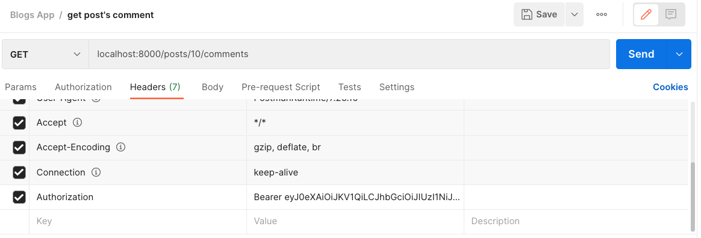

# Django JWT Authentication

เราจะมาดูวิธีการทำ Authentication ด้วย JWT กัน

<br><hr><br>

## Django JWT Setup

ให้เรา install package ที่ชื่อว่า `djangorestframework_simplejwt`

`pip install djangorestframework_simplejwt`

จากนั้นให้เพิ่ม REST_FRAMEWORK dict ตามนี้เข้าไปที่ `myproject/settings.py`

```python
REST_FRAMEWORK = {
    'DEFAULT_AUTHENTICATION_CLASSES': [
        'rest_framework_simplejwt.authentication.JWTAuthentication',
    ],
}
```

<br><hr><br>

## Login User

เมื่อ user สามารถ signup ได้แล้ว เราจะทำการสร้าง api login ขึ้นมา

ให้เราทำการเพิ่ม path login

```python
from django.urls import path

from . import views

urlpatterns = [
    path('signup', views.signup, name='signup'),
    path('login', views.login, name='login')
]
```

จากนั้นไปเขียน views รองรับ request ที่เข้ามาที่ path login

```python
@api_view(['POST'])
def login(request):
  return Response({ "message": "ok" })
```

จากนั้นเราจะไปสร้าง UserLoginSerializer สำหรับการ login

```python
class UserLoginSerializer(serializers.Serializer):
  email = serializers.CharField(max_length=255)
  password = serializers.CharField(max_length=128, write_only=True)
  token = serializers.CharField(max_length=128, read_only=True)
  refresh_token = serializers.CharField(max_length=128, read_only=True)
```

- UserLoginSerializer จะ inherit behavior มากจาก **serializers.Serializer** ไม่ใช่ **serializers.ModelSerializer** นะ
- ให้เราทำการเพิ่ม properties ข้อมูลให้ serializer จัดการตามนี้
  - email = serializers.CharField(max_length=255)
  - password = serializers.CharField(max_length=128, write_only=True)
  - token = serializers.CharField(max_length=128, read_only=True)
  - refresh_token = serializers.CharField(max_length=128, read_only=True)

จากนั้น เราจะเขียน function validate ขึ้นมา ซึ่งเป็น function ที่อยู่ใน `serializers.Serialize` ที่เอาไว้จัดการเกี่ยวกับการ validate ข้อมูลที่ส่งเข้ามาใน serializer แล้ว return ข้อมูลออกไป

```python
def validate(self, data):
    email = data.get("email", None)
    password = data.get("password", None)

    try:
      user = User.objects.get(email=email)
      is_password_valid = user.check_password(password)

      if user is None or not is_password_valid:
        raise serializers.ValidationError(
          'A user with this email and password is not matched.'
        )

      refresh = RefreshToken.for_user(user)
      update_last_login(None, user=user)

    except User.DoesNotExist:
      raise serializers.ValidationError(
          'User with given email and password does not exists'
      )

    return {
      "email": user.email,
      "token": str(refresh.access_token),
      "refresh_token": str(refresh)
    }
```

เมื่อเราเขียน serializer เสร็จแล้วให้เรามาเขียน code ที่ views ต่อ

```python
@api_view(['POST'])
def login(request):
  serializer = UserLoginSerializer(data=request.data)
  if serializer.is_valid():
    return Response({ "message": "login successfully", "data": serializer.data }, status=status.HTTP_200_OK)
  return Response({ "message": "login failed", "errors": serializer.errors }, status=status.HTTP_400_BAD_REQUEST)
```

แล้วให้เราลองยิง login api ด้วย postman เข้าที่ path `localhost:8000/auth/login` ด้วย method post และมี body เป็น email และ password ของ user ที่เราจะ login เข้ามา

```json
{
  "email": "test@gmail.com",
  "password": "123456789"
}
```

<br><hr><br>

## Protecting API Routes

เราจะทำการป้องกัน API ของเราไม่ให้คนทั่วไปเข้าได้ คนที่เข้าได้จะต้องเป็นคนที่ระบบเรายืนยันตัวตนแล้วเท่านั้น

เราจะลองป้องกัน API get post's comments

```python
from rest_framework.permissions import IsAuthenticated
from rest_framework.decorators import api_view, permission_classes

@api_view(['GET'])
@permission_classes([IsAuthenticated])
def comment_list(request, post_id):
  if request.method == "GET":
    comments = Comment.objects.filter(post_id=post_id)
    serializer = CommentSerializer(comments, many=True)
    return Response({ "data": serializer.data })
```

- เราจะ import IsAuthenticated มาจาก `rest_framework.permissions`
- จากนั้นให้เรา import `permission_classes` เพิ่มจาก `rest_framework.decorators` ซึ่งเป็นตัวที่กำหนดสิทธิ์การเข้าใช้งาน APIs
- จากนั้นให้เราเขียน decorator แปะไว้ที่หัว function แบบนี้ `@permission_classes([IsAuthenticated])` เพื่อเป็นการบอกว่าต้องทำ Authentication ก่อนเข้าใช้ API นี้ได้

จากนั้นให้เราลองยิง API get post comment เราจะสังเกตเห็นว่าเราจะได้ Response status 401 Unauthorized หมายความว่าเราไม่ได้รับการอนุญาติให้ใช้ API และ response message ตามนี้

```
{
    "detail": "Authentication credentials were not provided."
}
```

ให้เราไป login เพื่อเอา token มาก่อนจากนั้นให้เราใส่ token ไปที่ header ของ postman โดยใส่ key เป็น `Authorization` และ value เป็น `Bearer <our_jwt_token>` ตามรูป



<br><hr><br>

## Customize JWT

เราสามารถที่จะ Customize JWT ได้ผ่าน `myproject.py/settings.py`

ในที่นี้เราจะลองกำหนด ACCESS_TOKEN_LIFETIME เพิ่มขึ้นมาเป็น 10 นาที

```python
from datetime import timedelta

SIMPLE_JWT = {
    'ACCESS_TOKEN_LIFETIME': timedelta(minutes=10),
    'REFRESH_TOKEN_LIFETIME': timedelta(days=1),
    'ROTATE_REFRESH_TOKENS': False,
    'BLACKLIST_AFTER_ROTATION': True,
    'UPDATE_LAST_LOGIN': False,

    'ALGORITHM': 'HS256',
    'SIGNING_KEY': SECRET_KEY,
    'VERIFYING_KEY': None,
    'AUDIENCE': None,
    'ISSUER': None,

    'AUTH_HEADER_TYPES': ('Bearer',),
    'AUTH_HEADER_NAME': 'HTTP_AUTHORIZATION',
    'USER_ID_FIELD': 'id',
    'USER_ID_CLAIM': 'user_id',

    'AUTH_TOKEN_CLASSES': ('rest_framework_simplejwt.tokens.AccessToken',),
    'TOKEN_TYPE_CLAIM': 'token_type',

    'JTI_CLAIM': 'jti',

    'SLIDING_TOKEN_REFRESH_EXP_CLAIM': 'refresh_exp',
    'SLIDING_TOKEN_LIFETIME': timedelta(minutes=5),
    'SLIDING_TOKEN_REFRESH_LIFETIME': timedelta(days=1),
}
```

<br><hr><br>
