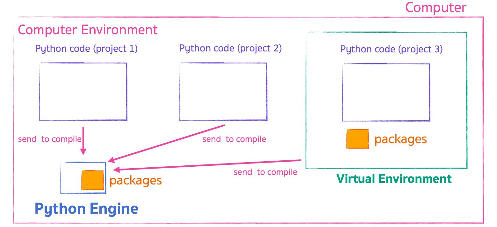

# Virtual Environment

เวลาเราพัฒนา App ด้วย Python เราต้องมีการใช้ 3rd Party Libraries หรือ Packages ใน ตัว App ของเราอยู่แล้ว
ซึ่งแต่ละ App เราจะใช้ไม่เหมือนกัน เพื่อไม่ให้เกิดการชนกัน เราจะแยกด้วย วิธีการ**สร้าง Environment ให้กับตัว App แต่ละ App** ซึ่งเรียกว่า **"Virtual Environments"**

 
 

## Virtual Environment Overall Picture

 
 

## Creating Virtual Environment

ให้เข้าไปที่ Folder Project ที่เราสร้างไว้ของเรา ผ่าน CMD / Terminal แล้วพิมพ์คําสั่ง `python -m venv env`

ใน MacOS ถ้าไม่ได้ Alias คำสั่ง python ให้เป็น python 3 ไว้ ให้ใช้คำสั่ง `python3 -m venv env`
